| Best Employee Management System on Internet |
|---------------------------------------------|
|  |

## 📑 Table of Contents
- [🌟 Introduction](#-introduction)
- [✨ Features](#-features)
  - [🎂 Birthday Features](#-birthday-features)
  - [👥 Employee Management](#-employee-management-admin-only)
  - [🔍 Search & Analytics](#-search--analytics)
  - [🛠️ Request System](#️-request-system)
  - [🔒 Role-Based Access](#-role-based-access)
- [📸 Screenshots](#-screenshots)
- [🚀 Getting Started](#-getting-started)
  - [Prerequisites](#prerequisites)
  - [Installation](#installation)
- [🙏 Acknowledgements](#-acknowledgements)
- [🛠️ Tech Stack](#️-tech-stack)
  - [Frontend](#frontend)
  - [Backend](#backend)
- [📄 License](#-license)

## 🌟 Introduction

BirthdayConnect is a full-stack employee management system with a special focus on birthday celebrations and seamless data management. Designed for both employees and admins, it offers:

    🎉 Birthday celebrations: Send/receive wishes, view birthday calendars

    🔍 Advanced search: Filter, analyze, and bulk-manage employee data

    📲 Mobile-friendly access: QR-code scanning for instant employee profiles

    ♻️ Data safety: Recycle bin for accidental deletions (admin-only)

    🔄 Request workflow: Employees propose changes, admins approve/reject

Built with React + Redux (Frontend) and Spring Boot + MySQL (Backend), it ensures secure role-based access for all operations.

## ✨ Features

### 🎂 Birthday Features

    Team celebrations: Any user can send multiple personalized messages to the birthday person

    Wish inbox: Birthday person can click the 'Inbox' button to view all received wishes in one place

    Auto-greetings: System displays a warm birthday banner on the recipient's homepage

    Interactive calendar: Tap any date to see birthdays and plan wishes in advance

### 👥 Employee Management (Admin-only)

    CRUD operations: Add/update/delete employees via form or Excel bulk upload

    Data export: Download employee lists as Excel/PDF

    QR profiles: Scan to view/save employee details on mobile devices

    Recycle bin: Restore accidentally deleted employees

### 🔍 Search & Analytics

    Smart filters: Narrow down employees by department, role, etc.

    Data charts: Visualize employee statistics (age, department distribution)

    Dual-view: Switch between card/list layouts

### 🛠️ Request System

    Employee requests: Submit profile change proposals

    Admin dashboard: Approve/reject requests with one click

### 🔒 Role-Based Access

    Employees: Send wishes, request updates, view profiles

    Admins: Full data control + request approval powers

## 📸 Screenshots

<details>
<summary><b>🔽 View All Screenshots (23 images)</b></summary>

### 🔐 Login

| Login Page | OTP Verification |
|------------|------------------|
| 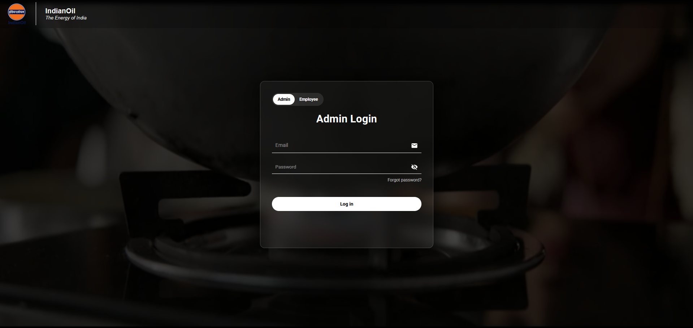 | 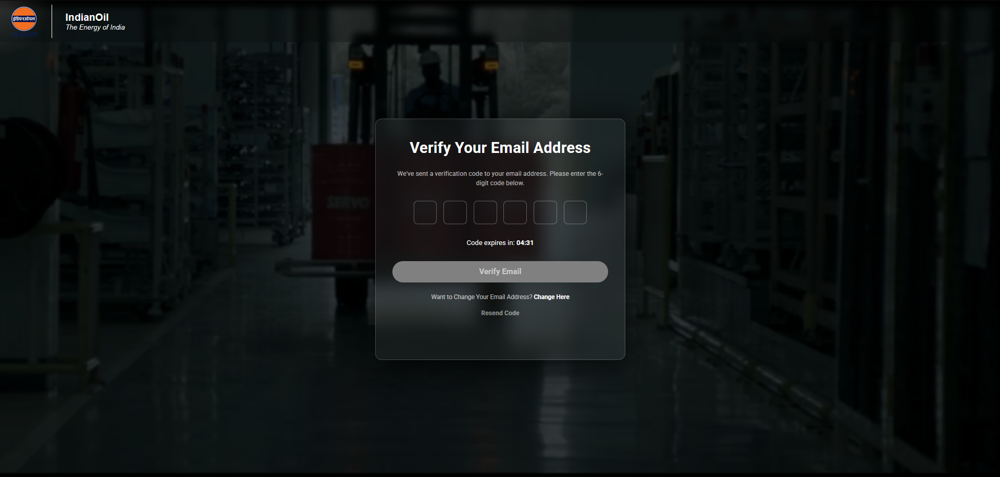 |

### 🏠 Home Page

| Welcome Screen | Birthday List |
|----------------|---------------|
| 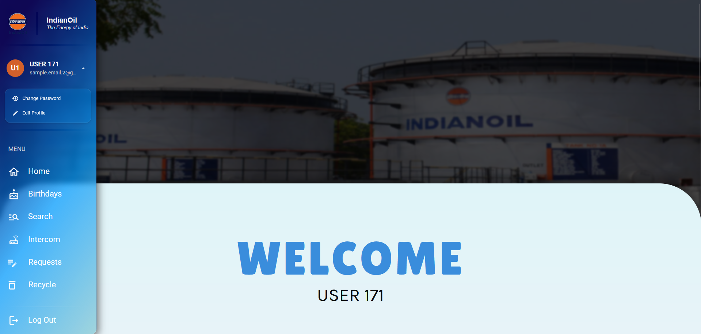 |  |

| Birthday Send Wish Portal | Birthday Wish Card |
|---------------------------|--------------------|
| 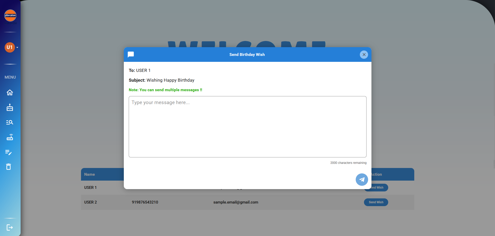 | 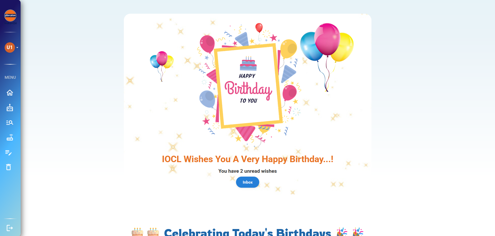 |

| Birthday Wish Inbox | Change Password |
|---------------------|-----------------|
| 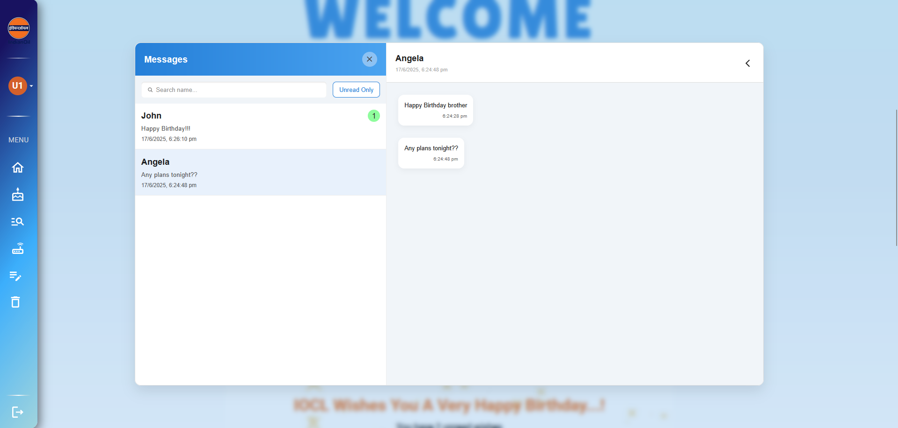 | 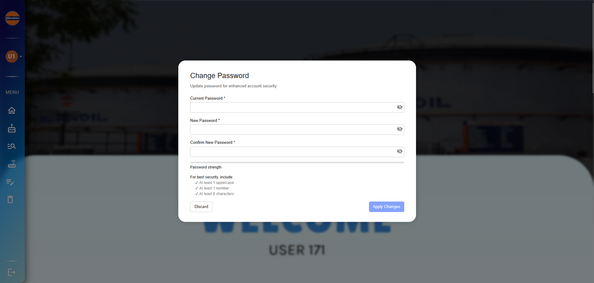 |

### 🎂 Birthday Page

| Overall Look |
|------------|
| 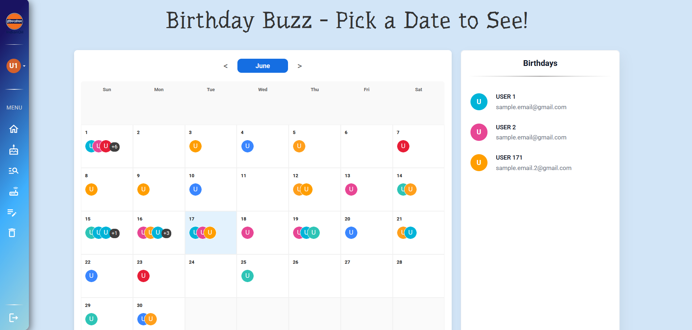 |

### 🔍 Search Page

| Overall Look |
|--------------|
| 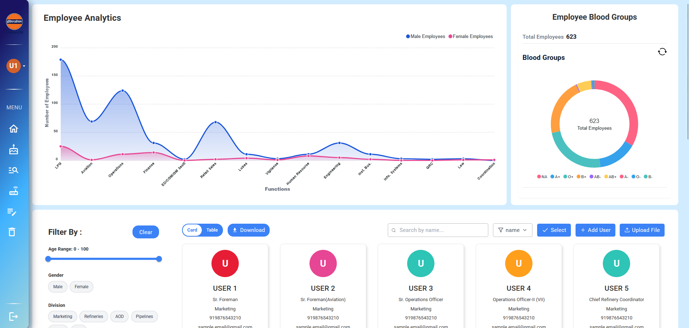 |

| Cards View | List View |
|------------|-----------|
|  | 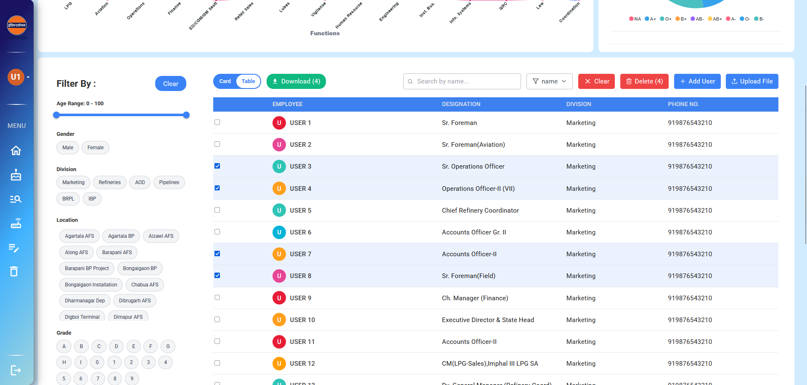 |

| Download Option | Add Employee Form |
|-----------------|-------------------|
| 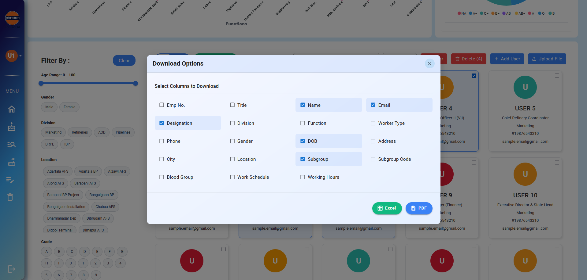 | 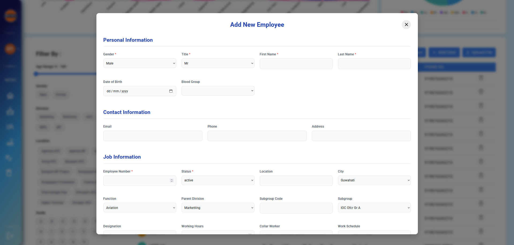 |

| Bulk Upload | User Details Cards |
|-------------|--------------------|
| 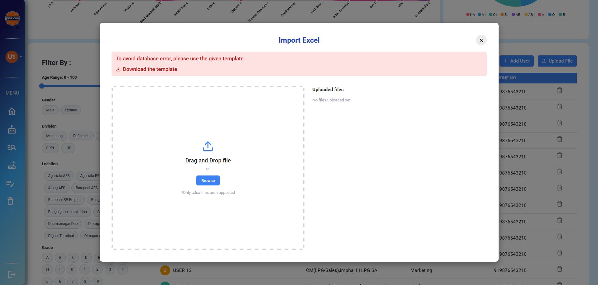 | 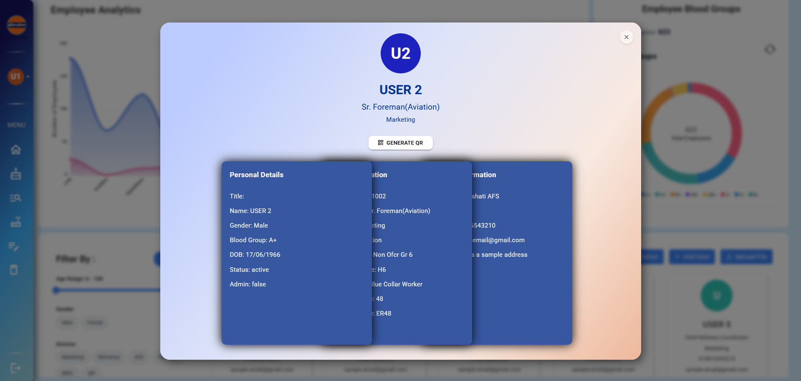 |

| Expanded Cards | QR Code Mobile View |
|----------------|---------------------|
| 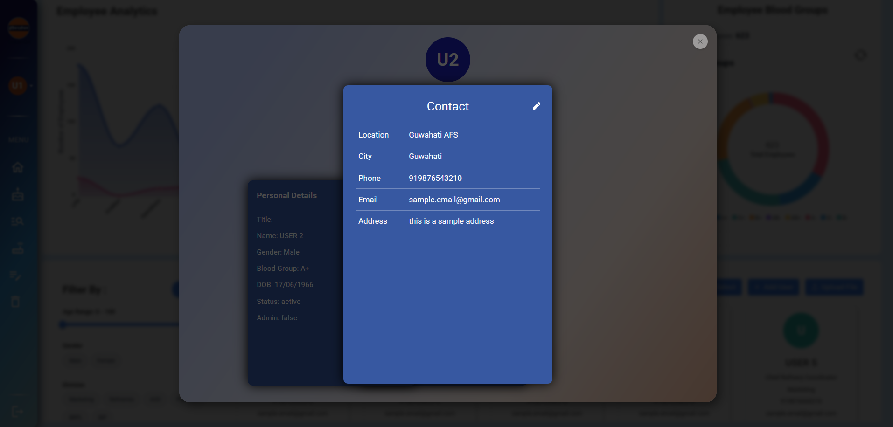 | 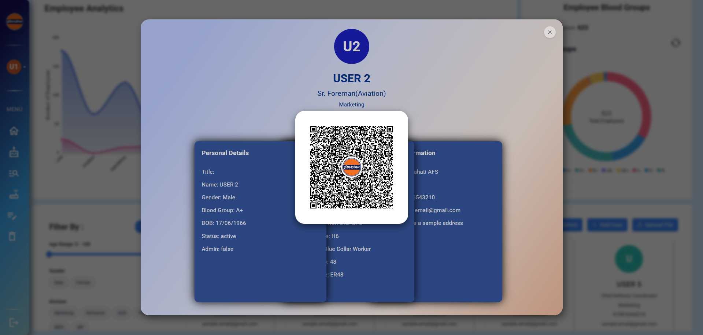 |

### 📞 Intercom Page

| Overall Look |
|--------------|
| 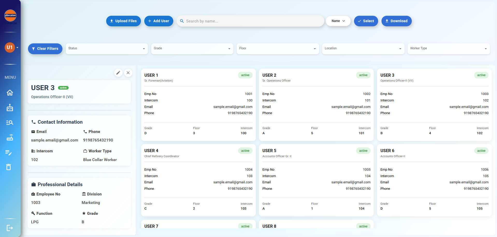 |

### 📋 Request Page

| Overall Look |
|--------------|
| 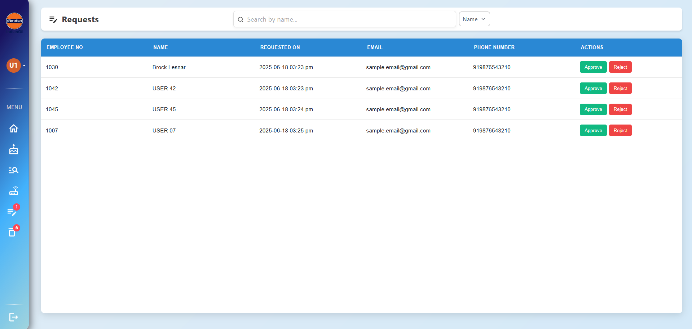 |

| Comparison Card | Accept / Reject |
|-----------------|-----------------|
| 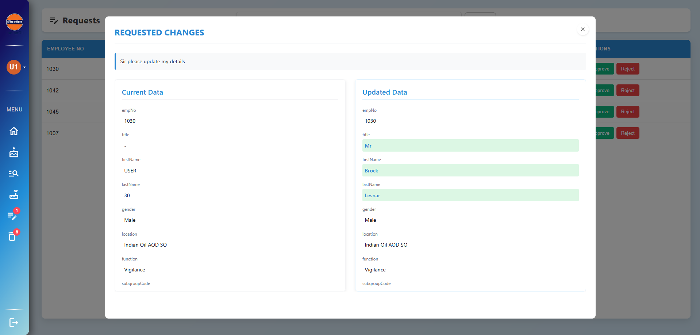 | 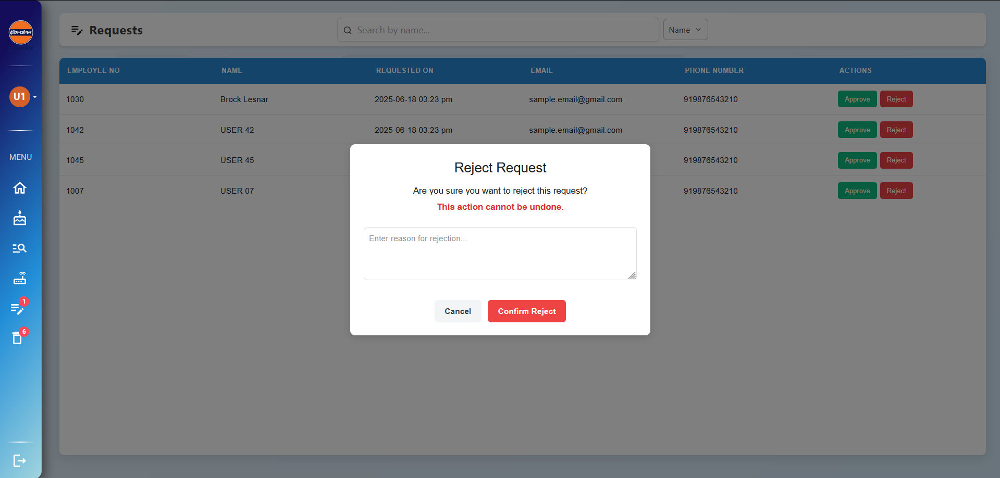 |

### ♻️ Recycle Page

| Overall Look |
|--------------|
| 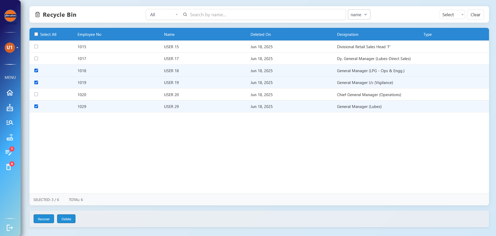 |

</details>


## 🚀 Getting Started

### Prerequisites
- Node.js (for frontend)
- Java JDK (for backend)
- MySQL/PostgreSQL (if applicable)

### Installation
1. **Frontend**:
   ```bash
   cd frontend
   npm install
   npm start
   ```

2. **Backend**:
   - Import as Maven project in your IDE
   - Configure database connection in `application.properties`
   - Run the main application class

## 🙏 Acknowledgements

This project was made possible thanks to:

    The React and Spring Boot communities for their incredible open-source tools

    Material UI and Framer Motion teams for helping create beautiful, interactive UI components

    Stack Overflow contributors who answered countless technical questions

    Our beta testers for their valuable feedback on the birthday messaging system

    GitHub Copilot for accelerated development (when it guessed our intentions correctly!)

    Coffee ☕ - The unsung hero that powered those late-night coding sessions

Special thanks to my colleague 'Pratyush Kumar Rabha" who helped turn this from an idea into a celebration platform!

## Tech Stack

### Frontend


### Backend


## 📄 License
This project is licensed under the MIT License - see the [LICENSE.md](LICENSE.md) file for details.